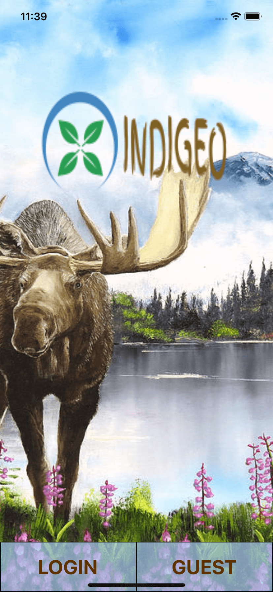
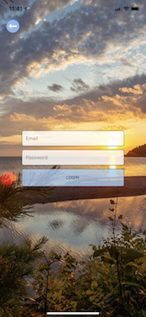
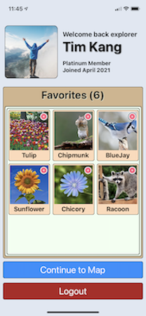
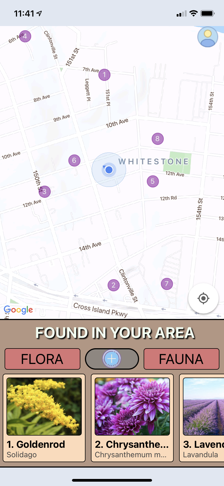
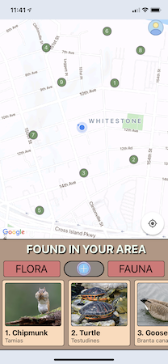
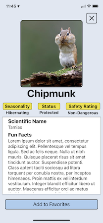

# Indigeo
Indigeo is a fun and interactive full stack mobile app that reveals nearby flora and fauna based on a user's geolocation.

## Technologies Featured

    
    
    
    
    

The application is developed for iOS mobile devices using React Native and Expo with thoughtful consideration and use of current React best practices: functional components using hooks and corresponding lifecycle methods, conditional rendering/styling, event handling, event-driven state, prop drilling and code splitting. The code base was built with a deliberate and conscious effort to write modular, reusable code. 

Undoubtedly, the main attraction of this app revolves around the features provided over a geographic map. The map in this app is powered by Google Maps through the React-Native-Maps package (https://github.com/react-native-maps/react-native-maps). Amongst the abundant features provided by this package, the MapView and Markers APIs are the components on which the main features of this application were built.

The backend is configured to the database and authentication services provided by Firebase. As a mobile application that dynamically responds to changes in the users' geographic coordinates, the application data needs to be accessible anywhere at anytime. Hence, as a cloud-based serverless backend solution, Firebase is the clear cut answer to meet the data requirements of this application. 

## Getting Started
Installation and setup is relatively simple. However, please ensure you have the following prerequisite programs on your current machine to ensure a smooth experience getting started. 

    REQUIRED
    - node
    - npm
    - Xcode
    
    OPTIONAL BUT RECOMMENDED
    - Expo Go (iOS application)

Clone this repo down and run "npm install". Once you have all of the dependencies installed, bring up a terminal and run "expo start". This will start up the expo server and connect to the application. While it is possible to view the application through an iPhone simulator, it is highly recommended that you view it directly on your mobile device using Expo Go as it enables the geotracking service which is critical to the app. 

# Components and Features 
## Home Screen
Users are greeted with an alluring background image and a custom designed logo upon entering the application. From here, users are provided with two divergent user flow paths:

    1. Login => Login screen for returning registered users
        OR
    2. Guest => Map screen for those who simply want to sample the app

## Login Screen
The bare features of this application can be enjoyed as a guest, but registered users have access to additional features. Returning users looking for their accounts will have to login using their registered email and password combination. The forms on this page validate the inputs before authenticating it through the Firebase authentication service. Once a user is successfully logged in, the user is redirected to the user profile screen. 

You cannot create a new account at this time but use the following credentials to login:
        
        email: indigeo@gmail.com
        password: indigeo

## Profile Screen
The profile screen displays personalized information about the logged in user. Most notably, the profile screen features a collection of favorites that the user has added previously or during the current session. The user has the ability to remove items from the list by tapping on the delete icon in the upper right corner of the card image. The CRUD operations are performed on persistent data that is stored and managed in a Firestore instance. 

The session will persist until the user explicitly logs out or closes the app. 

## Screenshots (set 1 of 2)

|                                  Home Screen                                   |                                  Login Screen                                   |                                  Profile Screen                                   |
| :----------------------------------------------------------------------------: | :-----------------------------------------------------------------------------: | :-------------------------------------------------------------------------------: |
|  |  |  |

## Map Screen
Users are presented with a list of the nearby plants and animals that can be geographically traced to markers on a map. There is currently no feature to view both of them concurrently, hence users must toggle between viewing one over the other.

Using asynchronous calls to the location API, the app captures the user's current coordinates and presents it on an instance of Google Maps. Concurrently, the application conditionally renders items that fall within the user's proximity. This geofence has been defined as +/- 0.01 degrees in both latitude and longitude. User movements are tracked and updates to the location will trigger updates to the map, the markers, and the corresponding list. 

Both logged in users and guest users will see a profile icon in the upper right hand corner of the map. When logged in users press that icon, they will be redirected to their profile screen. Guest users will be redirected to the login screen. 

## Detail Screen
Users have the ability to pull up additional information about any of the nearby items by simply pressing the screen. Pressing on one of the cards will render the details of the item that includes information in both text and tag formats. Logged in users will also see an 'Add to Favorites' button, while guest users will not have that button. Pressing the button will update the favorites list and the text will change to 'Added!'   
  
## Screenshots (set 2 of 2)
|                                 Map View of Flora                                  |                                 Map View of Fauna                                  |                               Detail Page Example                                |
| :--------------------------------------------------------------------------------: | :--------------------------------------------------------------------------------: | :------------------------------------------------------------------------------: |
|  |  |  |

